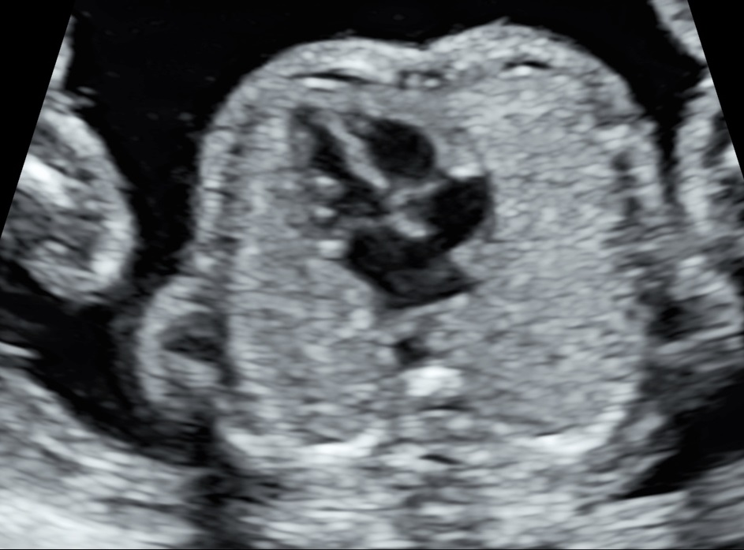
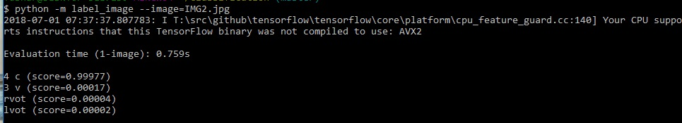

# Overview
Using deep learning libraries, built a medical image classifier to classify fetal heart images into four categories to reduce the efforts of medical professionals.
Used docker toolbox as a command line interface for windows and the models used for classifying the images have been taken from the  tensorflow-for-poets-2 github repository.

# Saving the images (Imp)
Save the classified images in a folder named Photos in tf_files directory inside main directory. 
There should be different folders for different classses inside Photos directory where in each class' folder there are
images corresponding to that class only. 

# Setting up the directory (Imp)
After setting up the environment, make sure that you are in the directory
of Classification folder which is downloaded from this repository. Do this by typing cd path_of_main_directory in the docker.

# Setting the image size
IMAGE_SIZE=224 \
ARCHITECTURE="mobilenet_0.50_${IMAGE_SIZE}"

Type these two commands in the docker to set the image size and the desired neural network algorithm.

# Starting tensorboard
tensorboard --logdir tf_files/training_summaries &

# Investigating the retraining script
python -m scripts.retrain -h

# Creating bottlenecks and training the images
Make sure the latest version of python 3.6 or above is installed on the docker, then run the following commands in the docker toolbox.

python -m scripts.retrain \
  --bottleneck_dir=tf_files/bottlenecks \
  --how_many_training_steps=500 \
  --model_dir=tf_files/models/ \
  --summaries_dir=tf_files/training_summaries/"${ARCHITECTURE}" \
  --output_graph=tf_files/retrained_graph.pb \
  --output_labels=tf_files/retrained_labels.txt \
  --architecture="${ARCHITECTURE}" \
  --image_dir=tf_files/Photos
  
# Help for the script to label an image
  --python -m scripts.label_image -h \
  --graph=tf_files/retrained_graph.pb  
  
  Run the above command to set the graph.
  
 # Rename the images 
 Bulk rename all the images which you want to classify using this tool called bulk rename. Rename each image as "image" and later remove  the parentheses () and put an _ instead. Hence images would be named as image_1, image_2, image_3, etc...
 http://www.bulkrenameutility.co.uk/Download.php. After renaming the files, save them in the main directory.
 
  # Creating folders 
  Create empty folders in the main directory with the same names as the folder classes.
  
  # Final step
  See how many images are there to classify in total and run this command in docker, where y is the number of images to classify
  
    for (( i=1; i<=y; i++))
  do \
    python -m label_image \
    image=image_$i.jpg \
  done 

Upon classification, the images will be classified into different categories and saved into their respective class folders.
    
 # Results:
 Here's an image which I tried classifying by training the model on approx 300-400 prelabelled images. 
 
 
 These are the results:
 
 
 The results predicted correspond to 95% assurance that the the view of the this image is right ventrical outflow tract (rvot view) which is a correct prediction.
 
 Second time, I used this image using the same classifier. 
 
 
 And these were the results:
  
 
 In this case, the results correctly predicted with 99% probability that the view is four chamber view (4-c).

